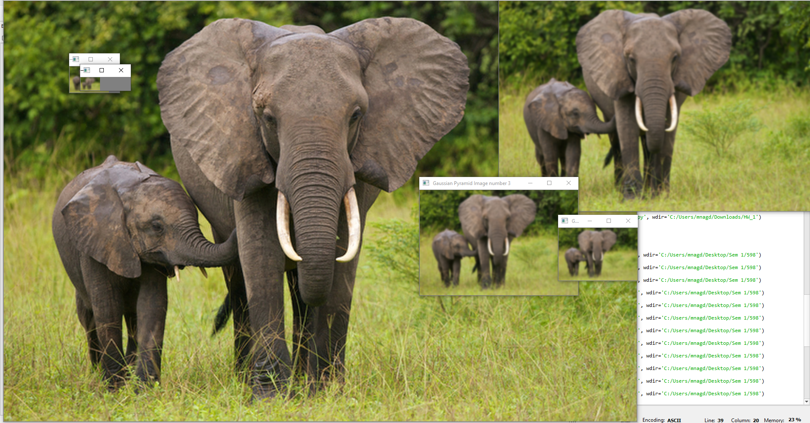
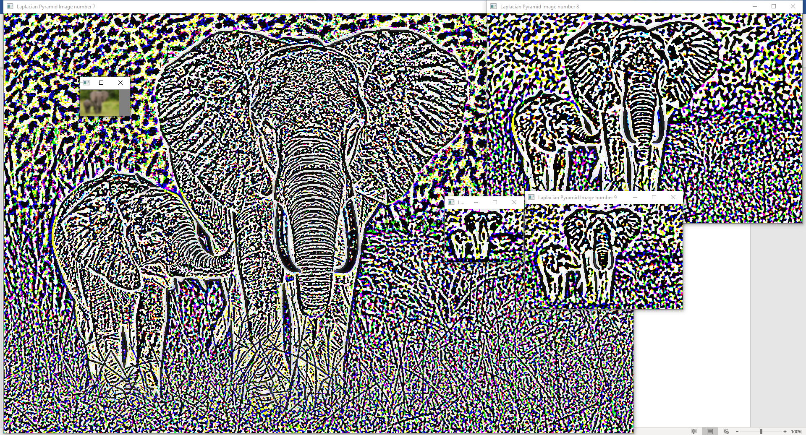
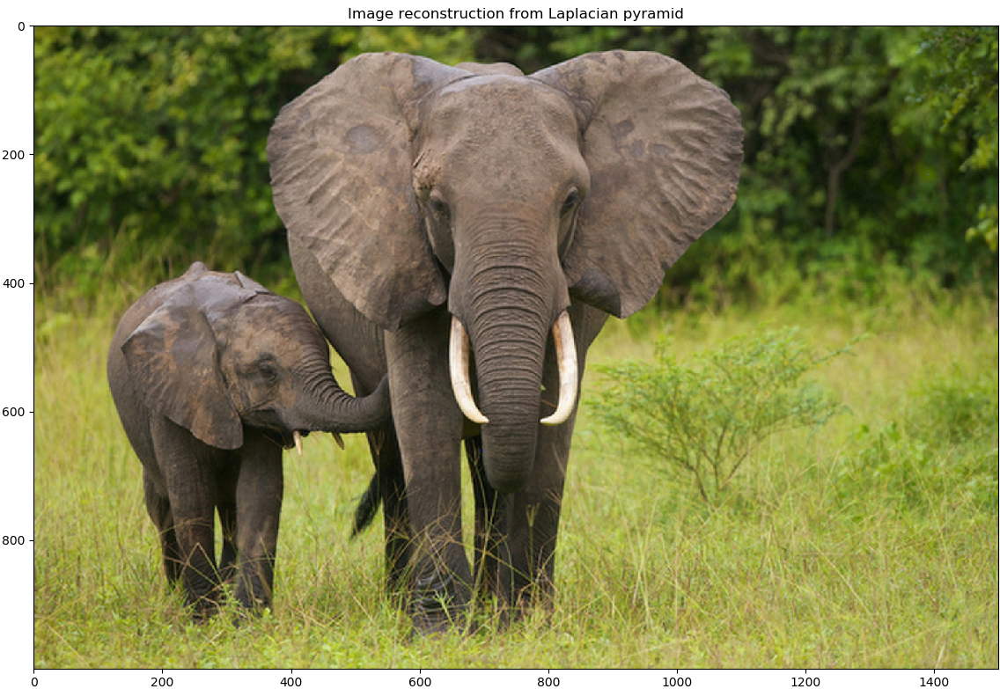
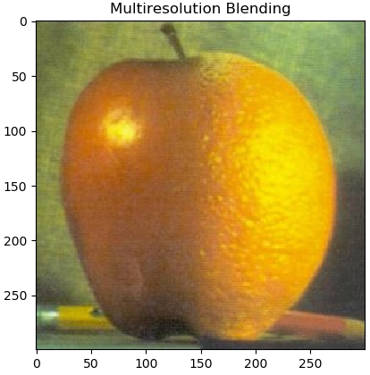

# Gaussian, Laplacian Pyramids and Multiresolution Blending

The objective was to generate Gaussian and Laplacian pyramids of an image and also check if the pyramids consolidated back to the original image. Multiresolution blending was tested to see how images can be
blended together seamlessly.

## Gaussian & Laplacian Pyramids

An elephant image was used for creating both the pyramids and reconstruction of that image.

The Gaussian pyramid obtained was-

  

The Laplacian pyramid obtained was-

  

The reconstructed image using the Laplacian pyramid of the elephant was-

  

## Multiresolution Blending

The aim was to use images of an orange and an apple of the same size and blend them together to obtain a new kind of fruit- orapple :stuck_out_tongue::stuck_out_tongue:. Gaussian pyramids were constructed for masks genertaed for both
the images along with Laplacian pyramids for both the fruit images themselves. These four values were used for blending both the images at each level of the pyramid. The final orapple image was made by consolidating each level of the blended pyramid. 

The orapple obtained was-

  

